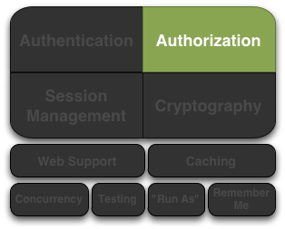

# ref: https://github.com/waylau/apache-shiro-1.2.x-reference/blob/master/I.%20Overview%20%E6%80%BB%E8%A7%88/2.%20Tutorial%20%E6%95%99%E7%A8%8B.md

# Shiro几乎所有的事情都和一个中心组件SecurityManager有关。

# Shiro使用
```
为了保护我们的程序安全，我们或许问自己最多的就是“谁是当前的用户？”，“或者当前登录用户的是否允许做某件事？”
通常我们会在写代码或者设计用户接口的时候问这些问题：程序通常建立在用户基础上，
程序功能展示(和安全)也基于每一个用户。所以，通常我们考虑我们程序安全的方法也建立在当前用户的基础上，
Shiro的API提供了“the current user”概念，即Subject

在几乎所有的环境中，你可以通过如下语句得到当前用户的信息：
Subject currentUser=SecurityUtils.getSubject();
```

# Architecture 架构


### Subject：
```
就像我们在上一章示例中提到的那样，Subject本质上是当前运行用户特定的'View'(视图)，而单词'User'经常暗指一个人，
Subject可以是一个人，但也可以是第三方服务、守护进程账户、时钟守护任务或者其他--当前和软件交互的任何事件。
Subject实例都和(也需要)一个Security Manager绑定，当你和一个Subject进行交互，这些交互动作被转换成SecirityManager下Subject特定的交互动作。
```

### SecurityManager：
```
SecurityManager是Shiro架构的核心，配合内部安全组件共同体组成安全伞。然而，一旦一个程序配置好了SecurityManager和他的内部对象，
SecurityManager通常独自留下来，程序开发人员几乎花费所有时间都集中在Subject API上。
任何Subject的安全操作中SecurityManager是幕后真正的举重者。
```

### Realms：
```
Realms是Shiro和你的程序安全数据之间的“桥”或者“连接”，它用来实际和安全相关的数据如用户执行身份认证(登陆)的账号和授权(访问控制)进行交互，
Shiro从一个或多个程序配置的Realm中查找这些东西。Realm本质上是一个特定的安全DAO：他封装与数据源连接的细节，得到Shiro所需的相关的数据。
在配置Shiro的时候，你必须指定至少一个Realm来实现认证(authentication)和/或授权(authorization)。SecurityManager可以配置多个复杂的Realm，
但至少有一个是需要的。Shiro提供开箱即用的Realms来连接安全数据源(或叫地址)如LDAP、JDBC、文件配置如INI和属性文件等，
如果已有Realms不能满足你的需求你也可以开发自己的Realm实现。和其他内部组件一样，Shiro  SecurityManager管理如何使用Realms获取实例多代表的安全和身份信息。
```

# Configuration 配置
```
Shiro可以在任何环境下工作，从简单的命令行到大型企业企业级集群项目，因为环境的多样化，可以通过许多途径来配置当前环境的配置方式进行配置。
```

## Programmatic Configuration 在程序中配置
创建一个SecurityManager并使之可用的简单的方法就是创建一个org.apache.shiro.mgt.DefaultSecurityManager 对象并将其写入到代码中，例如
```
Realm realm =//实例化获得一个Realm实例，
SecurityManager securityManager=new DefaultSecurityManager(realm);
//使SecurityManager实例通过静态存储器对整个应用程序可见：
SecurityUtils.setSecurityManager(securityManager);
```
仅仅三行代码，你就可以拥有一个适用于任何程序的功能全面的 Shiro 环境，多么简单。

### SecurityManager Object Graph
如同我们在架构（Architecture ）中讨论过的，Shiro SecurityMangger 本质上是一个由一套安全组件组成的对象模块视图（graph），因为与 JavaBean兼容，所以可以对所有这些组件调用的 getter 和 setter 方法来配置SecurityManager 和它的内部对象视图。

例如，你想用一个自定义的 SessionDAO 来定制 Session Management从而配置一个 SecurityManager 实例，你就可以使用 SessionManager 的 setSessionDAO 方法直接 set 这个 SessionDAO。
```
DefaultSecurityManager securityManager = new DefaultSecurityManager(realm);
SessionDAO sessionDAO = new CustomSessionDAO();
((DefaultSessionManager)securityManager.getSessionManager()).setSessionDAO(sessionDAO);
```
使用这些函数，你可以配置 SecurityManager 视图（graph）中的任何一部分。

虽然在程序中配置很简单，但它并不是我们现实中配置的完美解决方案。在几种情况下这种方法可能并不适合你的程序：

+ 它需要你确切知道并实例化一个直接实现（direct implementation），然而更好的做法是你并不需要知道这些实现也不需要知道从哪里找到它们。
+ 因为JAVA类型安全的特性，你必须对通过 get* 获取的对象进行强制类型转换，这么多强制转换非常的丑陋、累赘并且会和你的类紧耦合。
+ SecurityUtils.setSecurityManager 方法会将 SecurityManager 实例化为虚拟机的单独静态实例，在大多数程序中没有问题，但如果有多个使用 Shiro 的程序在同一个 JVM 中运行时，各程序有自己独立的实例会更好些，而不是共同引用一块静态内存。
改变配置就需要重新编译你的程序。

然而，尽管有这些不足，在程序中定制的这种方法在限制内存（memory-constrained ）的环境中还是很有价值的，像智能电话程序。如果你的程序不是运行在一个限制内存的环境中，你会发现基于文本的配置会更易读易用。

## INI Configuration 配置
通过ini配置文件来进行配置，
它假定所有对象都是兼容 JavaBean 的 POJO。在设置这些属性时，Shiro 默认使用 Apache 通用的 BeanUtils 来完成这项复杂的工作，所以虽然 INI 值是文本，BeanUtils 知道如何将这些字符串值转换为适合的原始值类型并调用合适的 JavaBeans 的 setter 方法

## Authentication认证
认证：就是身份验证的过程---也就是证明一个用户的真实身份。为了证明用户的身份，需要提供系统理解和相信的身份信息和证据。

需要通过向Shiro提供用户的身份(principals)和证明(credentials)来判断是否和系统要求的匹配。

+ Principals(身份)是Subject的"标识属性"，可以使任何与Subject相关的标识，比如名称(给定名称)、名字(姓名或者昵称)、用户名、安全号码等等。当然像昵称这样的内容不能很好的对Subject进行独特标识，所以最好的身份信息（Principals）是使用在程序中唯一的标识--典型的使用用户名或邮件地址
+ + Primary Principal(最主要的身份)虽然 Shiro 可以使用任何数量的身份，Shiro 还是希望一个程序精确地使用一个主要的身份--一个仅有的唯一标识 Subject 值。在多数程序中经常会是一个用户名、邮件地址或者全局唯一的用户 ID。
+ Credentials(证明) 通常是只有 Subject 知道的机密内容，用来证明他们真正拥有所需的身份，一些简单的证书例子如密码、指纹、眼底扫描和X.509证书等。

最常见的身份/证明是用户名和密码，用户名是所需的身份说明，密码是证明身份的证据。如果一个提交的密码和系统要求的一致，程序就认为该用户身份正确，因为其他人不应该知道同样的密码。

## Authenticating Subjects
Subject验证的过程可以有效地划分为以下三个步骤：
1、收集Subject提交的身份和证明
2、向Authentication提交身份和证明
3、如果提交的内容正确，允许访问，否则重新尝试或者拒绝访问。

### 第一步：收集用户身份和证明
```
//最常用的情况是username/password 对：
UsernamePasswordToken token=new UsernamePasswordToken(username,password);

//"Remember Me"功能是内建的
token.setRememberMe(true);
```
在这里我们使用 UsernamePasswordToken，支持所有常用的用户名/密码验证途径，这是一个 org.apache.shiro.authc.AuthenticationToken 接口的实现，这个接口被 Shiro 认证系统用来提交身份和证明

Shiro并不关心你如何获取这些信息：也许是用户从一个HTML表单中提交的或者其他方式获得的但是这与AuthenticationToken完全无关。

你可以随自己喜欢构造和引用AuthenticationToken实例 -- 这与协议无关

### 第二步：提交身份和证明
当身份和证明被收集并实例化为一个AuthenticationToken(认证令牌)后，我们需要向 Shiro 提交令牌以执行真正的验证尝试：
```
Subject currentUser=SecurityUtils.getSubject();

currentUser.login(token);
```
在获取当前执行的 Subject 后，我们执行一个单独的 login 命令，将之前创建的 AuthenticationToken 实例传给它。

调用 login 方法将有效地执行身份验证。

### 第三部：处理成功或失败
当login函数没有返回信息时表示验证通过了。程序可以继续运行，此时执行SecurityUtils.getSubject()将返回验证后的Subject实例，subject。isAuthenticated()将返回true

但是如果 login 失败了呢？例如，用户提供了一个错误的密码或者因访问系统次数过多而被锁定将会怎样呢？

Shiro拥有丰富的运行期异常AuthenticationException可以精确标明为何验证失败，你可以将 login 放入到 try/catch 块中并捕获所有你想捕获的异常并对它们做出处理。例如：
```
try {
    currentUser.login(token);
} catch ( UnknownAccountException uae ) { ...
} catch ( IncorrectCredentialsException ice ) { ...
} catch ( LockedAccountException lae ) { ...
} catch ( ExcessiveAttemptsException eae ) { ...
} ... 捕获你自己的异常 ...
} catch ( AuthenticationException ae ) {
    //未预计的错误?
}

//没问题，继续
```
如果原有的异常不能满足你的需求，可以创建自定义的AuthenticationExceptions 来表示特定的失败场景。

## Remembered VS. Authenticated
Shiro支持在登录过程中执行"remember me",在此值得指出，一个以及驻的Subject(remembered Subject)与
一个正常通过认证的Subject(authenticated Subject)在Shiro是完全不同的。

+ 记住的(Remembered):一个被记住的Subject没有已知身份(也就是说subject.getPrincipals()返回空),
但是他的身份被先前的认证过程记住，并存于先前session中，一个被认为记住的对象在执行subject.isRemembered()返回真。
+ 已验证(Authenticated):一个被验证的Subject是成功验证后(如登录成功)并存在于当前的session中，一个被认为验证过的对象调用subject.isAuthenticated()将返回真。

互斥的：已记住(Remembered) 和 已验证(Authenticated)是互斥的。一个标识值为真另一个就为假，反过来也一样。


## Logging Out 退出
与验证相对的是释放所有已知的身份信息，当Subject与程序不再交互了，你可以使用subject.logout()丢掉所有身份信息
```
currentUser.logout(); //清楚验证信息，使session失效
```
当你调用 logout，任何现存的 session 将变为不可用并且所有的身份信息将消失（如：在 web 程序中，RememberMe 的 Cookie 信息同样被删除）。

Web程序需注意：
因为在 Web 程序中记住身份信息往往使用 Cookies，而 Cookies 只能在 Response 提交时才能被删除，所以强烈要求在为最终用户调用subject.logout() 之后立即将用户引导到一个新页面，确保任何与安全相关的 Cookies 如期删除，这是 Http 本身 Cookies 功能的限制而不是 Shiro 的限制


## Authentication Sequence认证序列


+ 第一步：程序代码调用Subject.login方法，向AuthenticationToken(认证令牌)实例的构造函数传递用户的身份和证明。
+ 第二步：Subject实例，通常是一个DelegatingSubject(或其子类)通过调用securityManager.login(token)将这个令牌转交给程序SecurityManager。
+ 第三步：SecurityManager，基本的"安全伞"组件，得到令牌并通过调用 authenticator.authenticate(token)简单地将其转交其内部的Authenticator实例，
大部分情况下是一个ModularRealmAuthenticator实例，用来支持在验证过程中协调一个或者多个Realm实例。ModularRealmAuthenticator本质上为Apache Shiro（在 PAM 术语中每一个 Realm 称为一个“模块”）提供一个 PAM 类型的范例。
+ 第四步：如程序配置了多个Realm，ModularRealmAuthenticator实例将使用其配置的AuthenticationStrategy开始一个或者多个Realm身份验证的尝试。在Realm被验证调用的整个过程中，AuthenticationStrategy(安全策略)被调用用来回应每个Realm结果，我们将稍后讨论AuthenticationStrategies。

注意：单Realm程序
如果仅有一个Realm被配置，他直接被调用--在单Realm程序中不需要AutheticationStrategy。
+ 第五步：每一个配置的Realm都被检验看成其是否支持提交的AuthenticationToken。如果支持，则该 Realm 的 getAuthenticationInfo 方法随着提交令牌被调用，getAuthenticationInfo 方法为特定的 Realm 有效提供一次独立的验证尝试

### Authenticator

Shiro SecurityManager implementations默认使用一个 ModularRealmAuthenticator 实例， ModularRealmAuthenticator 同样支持单 Realm 和多 Realm

在一个单 Realm 程序中，ModularRealmAuthenticator 将直接执行单独的 Realm，如果配置有两个或以上 Realm，将会使用AuthenticationStrategy 实例来协调如何进行验证，我们将在下面的章节中讨论 AuthenticationStrategy。

如果你希望用自定义的 Authenticator 实现配置 SecurityManager，你可以在 shiro.ini 中做这件事，如：
```
[main]
····
authenticator = com.wangjie.customerAuthenticator;

securityManager.authenticator= $authenticator;
```
尽管在实际操作中，ModularRealmAuthenticator使用于大部分需求

### AuthenticationStrategy
当一个程序中定义了两个或者多个realm时，ModularRealmAuthenticator使用一个内部的AuthenticationStrategy 组件来决定一个验证是否成功。

例如，如果一个Realm 验证一个 AuthenticationToken 成功，但其他的都失败了，那这次尝试是否被认为是成功的呢？是不是所有 Realm 验证都成功了才认为是成功？
又或者一个 Realm 验证成功，是否还有必要讨论其他Realm？AuthenticationStrategy 根据程序需求做出恰当的决定。

AuthenticationStrategy 是一个 stateless 的组件，在整个验证过程中在被用到4次（在这4次活动中需要必要的 state 时，state 将作为方法参数传递）
+ 在任何 Realms 被执行之前；
+ 在某个的 Realm 的 getAuthenticationInfo 方法调用之前；
+ 在某个的 Realm 的 getAuthenticationInfo 方法调用之后；
+ 在所有的 Realm 被执行之后。
AuthenticationStrategy 还有责任从每一个成功的 Realm 中收集结果并将它们“绑定”到一个单独的 AuthenticationInfo，
这个AuthenticationInfo 实例是被 Authenticator 实例返回的，并且 shiro 用它来展现一个 Subject 的最终身份（也就是 Principals ）

Subject 身份“展示（view）”

如果你在程序中使用多于一个的 Realm 从多个数据源中获取帐户数据，程序可看到的是 AuthenticationStrategy 最终负责 Subject 身份最终“合并（merged）”的视图

Shiro有3个具体的AuthenticationStrategy实现：

<table>
<tr>
    <th>AuthenticationStrategy  class</th>
    <th>Description</th>
</tr>
<tr>
    <td>AtLeastOneSuccessfulStrategy</td>
    <td>如果有一个或多个Realm验证成功，所有的尝试都被认为是成功的，如果没有一个验证成功，则该次尝试失败</td>
</tr>
<tr>
    <td>FirstSuccessfulStrategy</td>
    <td>只有从第一个成功验证的Realm返回的信息会被调用，以后的Realm将被忽略，如果没有一个验证成功，则该次尝试失败</td>
</tr>
<tr>
    <td>AllSuccessfulStrategy</td>
    <td>所有配置的Realm在全部尝试中都成功验证才被认为是成功，如果有一个验证不成功，则该次尝试失败</td>
</tr>
</table>

ModularRealmAuthenticator 默认使用 AtLeastOneSuccessfulStrategy 实现，这也是最常用的策略，然而你也可以配置你希望的不同的策略。
```shiro.ini
[main]
···
authcStrategy = org.apache.shiro.authc.FirstSuccessfulStrategy

securityManager.authenticator.authenticatStrategy = $authcStrategy
```

自定义的 AuthenticationStrategy

如果你希望创建你自己的 AuthenticationStrategy 实现，你可以使用 org.apache.shiro.authc.pam.AbstractAuthenticationStrategy 作为起始点。
AbstractAuthenticationStrategy 类自动实现 '绑定（bundling）'/聚集（aggregation）行为将来自于每个Realm 的结果收集到一个 AuthenticationInfo 实例中。

### Realm 验证的顺序
非常重要的一点是，和Realm交互的ModularRealmAuthenticator按迭代(iteration)顺序执行。

ModularRealmAuthenticator可以访问为SecurityManager配置的Realm实例，
当尝试一次验证时，它将在集合中遍历，支持对提交的 AuthenticationToken 处理的每个 Realm 都将执行 Realm 的 getAuthenticationInfo 方法。

### 隐含的顺序
在使用ShiroINI配置文件形式时，你可以按你希望其处理AuthenticationToken 的顺序来配置 Realm，例如，在shiro.ni 中，Realm 将按照他们在INI文件中定义的顺序执行。
```
blahRealm = com.company.blah.Realm
...
fooRealm = com.company.foo.Realm
...
barRealm = com.company.another.Realm
```

SecurityManager上配置了这三个 Realm，在一个验证过程中，blahRealm, fooRealm, 和 barRealm 将被顺序执行。
这基本上与定义下面这一行语句的效果相同：

```
securityManager.realms = $blahRealm, $fooRealm, $barRealm
```
使用这种方法，你不需要设置 securityManager 的 realm 顺序，每一个被定义的realm 将自动加入到 realms 属性中。

### Explicit Ordering明确的顺序
如果你希望明确定义 realm 执行的顺序，不管他们如何被定义，你可以设置 SecurityManager 的 realms 属性，例如，使用上面定义的 realm，但你希望 blahRealm 最后执行而不是第一个：
```
blahRealm = com.company.blah.Realm
...
fooRealm = com.company.foo.Realm
...
barRealm = com.company.another.Realm

securityManager.realms = $fooRealm, $barRealm, $blahRealm
```
明确 Realm 包含

当你明确的配置 securityManager.realms 属性时，只有被引用的 realm 将为 SecurityManager 配置，也就是说你可能在 INI 中定义了5个 realm，但实际上只使用了3个，如果在 realm 属性中只引用了3个，这和隐含的 realm 顺序不同，在那种情况下，所有有效的 realm 都会用到。

## Authorization 授权


授权，亦即访问控制，是管理资源访问的过程，换言之，也就是控制在一个程序总"谁"有权利访问"什么"。
授权的例子有：是否允许这个用户查看这个页面，编辑数据，看到按钮，或者从这台打印机打印？这些决定是一个用户可以访问什么的决断。

### Element of Authorization 元素
授权有三个核心元素，在Shiro中我们经常要用到他们：权限(permission)、角色(roles)、用户(users)。

#### Permissions
权限是Apache Shiro中安全策略最基本的元素，他们是一组关于行为的基本指令，以明确表示在一个程序中什么可以做。
一个很好定义的权限指令必须描述资源以及当一个Subject与这些资源交互时什么动作可以执行

下面是一些权限指令的例子：
+ 打开一个文件
+ 查看 "/user/list" 页面
+ 打印文档
+ 删除 "Jsmith" 用户

大部分资源都支持基本的CRUD(增create、查read、改update、删delete)操作，但对于特定类型，任何动作都是可以的。
权限设置最基础的思想是在资源和动作的基础上设置最小量的权限指令

当看到权限时，最重要的一点是要认识到一个权限指令不是描述"谁"可以执行这个动作，而是描述"什么"可以做的指令。

权限只描述行为

权限指令只描述行为(和资源相关的动作)，并不关心"谁"有能力执行这个动作。

定义 "谁(用户)" 被允许做 "什么(权限)" 需要用一些方法将权限赋给用户，这通常取决于程序的数据模型而且经常在程序中发生改变。

例如，一组权限可以归于一个角色而角色与一个或多个用户对象关联，或者一些程序可以有一组用户而一个组可以指定一个角色，在这里关系将被传递也就是说组内用户隐含被赋予角色的权限。

#### Permission Granularity 权限粒度
上面的权限示例都是针对资源(门、文件、客户)指定的动作(打开、读、删除等)，在一些场景中，他们也会指定非常细粒度的"实例级别"行为 -- 
例如，"删除"(delete)名为"Jsmith"(实例标识)的"用户(资源类型)"，在Shiro中，你可以精确定义指定到你所能细化到的程度。


### Roles
角色是一个实体名，代表一组行为或职责，这些行为在程序中转换为你可以或者不能做的事情。角色通常赋给用户帐号，关联后，用户就可以“做”属于不同角色的事情

有两种有效的角色指定方式，Shiro 都支持。

+ 权限隐含于角色中：大部分用户将权限隐含于创建的角色中：程序只是在一个角色名称上隐含了一组行为（也就是权限），使用时，在软件级别不会说“某角色允许执行行为A、B和C”，而是将行为隐含于一个单独的角色名字中。

潜在的安全隐患

虽然这是一个非常简单和常用的方法，但隐含的角色可能会增加软件的维护成本和管理问题。
例如，如果你想增加或删除一个角色，或者重定义角色的行为怎么办？你不得不重新打开代码，修改所有对更改后的角色的检测，每次都需要这样做，这还没提到其引起的执行代价（重测试，通过质量验证，关闭程序，升级软件，重启程序等）。
对于简单程序这种方法可能适用（比如只有一个'admin'角色和'everyone else'角色），但复杂的程序中，这会成为你程序生命周期中一个主要的问题，会给你的软件带来很大的维护代价。

+ 明确为角色指定权限：明确为角色指定权限本质上是一组权限指令的名称集，在这种形式下，程序（以及 Shiro）准确知道一个特定的角色是什么意思，因为它确切知道某行为是否可以执行，而不用去猜测特定的角色可以或不可以做什么。

Shiro 团队提倡使用权限和明确为角色指定权限替代原始的将权限隐含于角色中的方法，这样你可以对程序安全提供更强的控制。

### Users用户
一个用户本质上是程序中的“谁”，如同我们前面提到的，Subject 实际上是 shiro 的“用户”。

用户（Subjects）通过与角色或权限关联确定是否被允许执行程序内特定的动作，程序数据模型确切定义了 Subject 是否允许做什么事情。

例如，在你的数据模型中，你定义了一个普通的用户类并且直接为其设置了权限，或者你只是直接给角色设置了权限，然后将用户与该角色关联，通过这种关联，用户就“有”了角色所具备的权限，或者你也可以通过“组”的概念完成这件事，这取决于你程序的设计。

数据模型定义了如何进行授权，Shiro 依赖一个 Realm 实现将你的数据模型关联转换成 Shiro 可以理解的内容，我们将稍后讨论 Realms。

最终，是 Realm 与你的数据源（RDBMS,LDAP等）做交流，Realm 用来告知Shiro 是否角色或权限是否存在，你可以完全控制你的授权模型如何创建和定义。

### Authorizing Subject 授权对象
在Shiro中执行授权可以有三种途径：
+ 程序代码 --- 你可以在你的JAVA代码中执行用类似于if和else的结构来执行权限检查
+ JDK注解 --- 你可以在你的JAVA方法上附加权限注解
+ JSP/GSP标签 --- 你可以给予角色和权限控制JSP或GSP页面的输出内容

### Programmatic Authorization 程序中检查授权
直接在程序中为当前 Subject 实例检查授权可能是最简单也最常用的方法。

##### Role-Based Authorization 基于角色的授权
如果你要基于简单/传统的角色名进行访问控制，你可以执行角色检查：

##### Role Checks 角色检查
如果你想简单地检查一下当前Subject是否拥有一个角色，你可以在一个实例上调用 hasRole* 方法。
例如，查看一个 Subject 是否有特定（单独）的角色，你可以调用subject.hasRole(roleName)方法，做出相应的反馈。

```
Subject currentUser = SecurityUtils.getSubject();

if (currentUser.hasRole("administrator")) {
    //显示 admin 按钮
} else {
    //不显示按钮?  灰色吗？
}
```

<table>
    <tr>
        <th>Subject 方法</th>
        <th>描述</th>
    </tr>
    <tr>
        <td>hasRole(String roleName)</td>
        <td>如果Subject指定了特定的角色返回真，否则返回假</td>
    </tr>
    <tr>
         <td>hasRoles(List<String> roleNames)</td>
         <td>返回一个与参数顺序相对应的hasRole结果数组，当一次有多个角色需要判断的时候非常有用(如制定一个复杂的视图)</td>
    </tr>
    <tr>
         <td>hasAllRoles(Collection<String> roleNames)</td>
         <td>如果Subject具备所有角色返回真，否则返回假。</td>
    </tr>
</table>

##### Role Assertions 角色判断
还有另一个方法检测Subject是否是指定为某个角色，你可以在代码执行之前简单判断他们是否是所要求的角色，
如果Subject不是所要求的角色，将抛出AuthorizationException异常，如果是所要求的角色，判断将安静地执行并按期望顺序执行下面的逻辑。
```
Subject currentUser = SecurityUtils.getSubject();

//保证当前用户是一个银行出纳员
//因此允许开立帐户：
currentUser.checkRole("bankTeller");
openBankAccount();
```
与hasRole* 方法相比，这种方法的好处在于代码更为清晰，如果当前的Subject不满足所需条件，将会抛出异常

<table>
    <tr>
        <th>Subject方法</th>
        <th>描述</th>
    </tr>
    <tr>
        <td>checkRole(String roleName)</td>
        <td>如果Subject被指定为特定角色则安静地返回否则抛出AuthorizationException异常；</td>
    </tr>
    <tr>
        <td>checkRoles(Collection roleNames)</td>
        <td>如果Subject被指定了所有特定的角色则安静地返回否则抛出AuthorizationException异常；</td>
    </tr>
    <tr>
        <td>checkRoles(String... roleNames)</td>
        <td>和上面的checkRoles具有相同的效果，但允许Java5的变参形式。</td>
    </tr>
</table>

### Permission-Based Authorization 基于权限的授权
就像我们上面在角色概述中提到的，通过基于权限的授权执行访问控制是更好的方法。基于权限的授权，
因为其与程序功能（以及程序核心资源上的行为）紧密联系，基于权限授权的源代码在程序功能改变时才需要改变，而与安全策略无关。这意味着与同样基于角色的授权相比，对代码的影响更少。

##### Permission Checks 权限检查
如果你希望检查一个Subject是否允许做某件事情，你可以调用isPermitted*方法的变形，有两个主要方式检查授权 -- 基于对象的权限实例和基于字符串的权限表示。

##### Object-based Permission Checks 基于对象的权限检查

执行权限检查的一种方法是实例化一个Shiro的org.apache.shiro.authz.Permission接口并且将它传递给接收权限实例的*isPermitted 方法。

例如，假设一下以下情景：办公室里有一台唯一标识为 laserjet4400n 的打印机，在我们向用户显示打印按钮之前，软件需要检查当前用户是否允许用这台打印机打印文档，检查权限的方式会是这样：

```
Permission printPermission = new PrinterPermission("laserjet4400n", "print");

Subject currentUser = SecurityUtils.getSubject();

if (currentUser.isPermitted(printPermission)) {
    //显示 打印 按钮
} else {
    //不显示按钮?  灰色吗？
}
```
我们同样看到了一个非常强大的实例级别的访问控制检查--在单独数据实例上限制行为的能力。
基于对象的权限对下列情况非常有用:
+ 希望编译期类型安全
+ 希望确保正确地引用和使用的权限
+ 希望对权限判断逻辑（称作权限隐含逻辑，基于权限接口的 implies方法）执行方式进行明确控制；
+ 希望确保权限正确地反映程序资源（例如，在一个对象域模型上创建一个对象时，权限类可能自动产生）。

<table>
    <tr>
        <th>Subject 方法</th>
        <th>描述</th>
    </tr>
    <tr>
        <td>isPermitted(Permission p)</td>
        <td>如果Subject允许执行特定权限实例综合指定的动作或资源访问权返回真，否则返回假；</td>
    </tr>
    <tr>
        <td>isPermitted(List perms)</td>
        <td>按参数顺序返回isPermitted的结果数组，如果许多权限需要检查时非常有用（如定制一个复杂的视图）</td>
    </tr>
    <tr>
        <td>isPermittedAll(Collection perms)</td>
        <td>如果Subject拥有指定的所有权限返回真，否则返回假。</td>
    </tr>
</table>


##### String-based permission checks 基于字符串的权限检查

虽然基于对象的权限检查很有用（编译期类型安全，对行为担保，定制隐含逻辑等），但在许多程序里有时候感觉有点笨重，另一种选择是用普通的字符串来代表权限。

例如，对于上面打印权限的例子，我们可以使用字符串权限检查达到同样的结果
```
Subject currentUser = SecurityUtils.getSubject();

if (currentUser.isPermitted("printer:print:laserjet4400n")) {
    //显示 打印 按钮
} else {
    //不显示按钮?  灰色吗？
}
```
上面的代码块基本上是下面这段代码的缩写：
```
Subject currentUser = SecurityUtils.getSubject();

Permission p = new WildcardPermission("printer:print:laserjet4400n");

if (currentUser.isPermitted(p) {
    //显示 打印 按钮
} else {
    //不显示按钮?  灰色吗？
}
```
<table>
    <tr>
        <th>Subject 方法</th>
        <th>描述</th>
    </tr>
    <tr>
        <td>isPermitted(String perm)</td>
        <td>如果Subject被允许执行字符串表达的动作或资源访问权限，返回真，否则返回假；</td>
    </tr>
    <tr>
        <td>isPermitted(String... perms)</td>
        <td>按照参数顺序返回isPermitted的结果数组，当许多字符串权限需要检查时非常有用（如定制一个复杂的视图时）；</td>
    </tr>
    <tr>
        <td>isPermittedAll(String... perms)</td>
        <td>当Subject具备所有字符串定义的权限时返回真，否则返回假。</td>
    </tr>
</table>


##### Permission Assertions 权限判断

另一种检查 Subject 是否被允许做某件事的方法是，在逻辑执行之前简单判断他们是否具备所需的权限，
如果不允许，AuthorizationException异常被抛出，如果是允许的，判断将安静地执行并按期望顺序执行下面的逻辑。

```
Subject currentUser = SecurityUtils.getSubject();

//担保允许当前用户
//开一个银行帐户：
Permission p = new AccountPermission("open");
currentUser.checkPermission(p);
openBankAccount();
```
或者，同样的判断，可以用字符串形式：
```
Subject currentUser = SecurityUtils.getSubject();

//担保允许当前用户
//开一个银行帐户：
currentUser.checkPermission("account:open");
openBankAccount();
```
与 isPermitted* 方法相比较，这种方法的优势是代码更为清晰，
如果当前Subject 不符合条件，你不必创建你自己的 AuthorizationExceptions 异常（如果你不想那么做）。

<table>
    <tr>
        <th>Subject 方法</th>
        <th>描述</th>
    </tr>
    <tr>
        <td>checkPermission(Permission p) </td>
        <td>如果Subject被允许执行特定权限实例指定的动作或资源访问，安静地返回，否则抛出AuthorizationException异常。</td>
    </tr>
    <tr>
        <td>checkPermission(String perm)</td>
        <td>如果Subject被允许执行权限字符串指定的动作或资源访问，安静地返回，否则抛出AuthorizationException异常。</td>
    </tr>
    <tr>
        <td>checkPermissions(Collection perms)</td>
        <td>如果Subject被允许执行所有权限实例指定的动作或资源访问，安静地返回，否则抛出AuthorizationException异常。</td>
    </tr>
    <tr>
        <td>checkPermissions(String... perms)</td>
        <td>和上面的checkPermissions效果一样，只是使用字符串权限类型。</td>
    </tr>
</table>

### Annotation-based Authorization 基于注解的授权

如果你更喜欢基于注解的授权控制，除了Subject的API之外，Shiro还提供了一个Java5的注解集

##### Configuration 配置
在你使用Java的注解之前，你需要在程序中启动AOP支持。不同的AOP框架有不同的配置方式。

###### RequiresAuthentication注解
RequiresAuthentication注解标识在访问或者调用被注解的类/实例/方法时，要求Subject在当前的Session中已经被验证过了。
```
@RequiresAuthentication
public void updateAccount(Account userAccount) {
    //这个方法只会被调用在
    //Subject 保证被认证的情况下
    ...
}
```
这基本上与下面的基于对象的逻辑效果相同：
```
public void updateAccount(Account userAccount) {
    if (!SecurityUtils.getSubject().isAuthenticated()) {
        throw new AuthorizationException(...);
    }

    //这里 Subject 保证被认证的情况下
    ...
}
```

###### RequiresGuest注解
RequiresGuest注解表示要求当前Subject是一个"guest(访客)",也就是，也就是在访问或者调用被注解的类/实例/方法时，要求他们没有被认证或者在被前一个Session记住。

例如：
```
@RequiresGuest
public void signUp(User newUser) {
    //这个方法只会被调用在
    //Subject 未知/匿名的情况下
    ...
}
```
这基本上与下面的基于对象的逻辑效果相同
```
public void signUp(User newUser) {
    Subject currentUser = SecurityUtils.getSubject();
    PrincipalCollection principals = currentUser.getPrincipals();
    if (principals != null && !principals.isEmpty()) {
        //已知的身份 - 不是 guest（访客）:
        throw new AuthorizationException(...);
    }

    //在这里 Subject 确保是一个 'guest（访客）'
    ...
}
```

###### RequiresPermissions 注解
RequiresPermissions注解表示要求当前Subject在执行被注解的方法时具有一个或者多个对应的权限。
例如：
```
@RequiresPermissions("account:create")
public void createAccount(Account account) {
    //这个方法只会被调用在
    //Subject 允许创建一个 account 的情况下
    ...
}
```
这基本上与下面的基于对象的逻辑效果相同
```
public void createAccount(Account account) {
    Subject currentUser = SecurityUtils.getSubject();
    if (!subject.isPermitted("account:create")) {
        throw new AuthorizationException(...);
    }

    //在这里 Subject 确保是允许
    ...
}
```

###### RequiresRoles 注解

RequiresRoles 注解表示要求当前Subject在执行被注解的方法时具备所有的角色，否则将抛出 AuthorizationException 异常。
例如：
```
@RequiresRoles("administrator")
public void deleteUser(User user) {
    //这个方法只会被 administrator 调用 
    ...
}
```
这基本上与下面的基于对象的逻辑效果相同
```
public void deleteUser(User user) {
    Subject currentUser = SecurityUtils.getSubject();
    if (!subject.hasRole("administrator")) {
        throw new AuthorizationException(...);
    }

    //Subject 确保是一个 'administrator'
    ...
}
```

###### RequiresUser 注解
RequiresUser* 注解表示要求在访问或调用被注解的类/实例/方法时，
当前 Subject 是一个程序用户，“程序用户”是一个已知身份的 Subject，或者在当前 Session 中被验证过或者在以前的 Session 中被记住过。

例如：
```
@RequiresUser
public void updateAccount(Account account) {
    //这个方法只会被 'user' 调用 
    //i.e. Subject 是一个已知的身份with a known identity
    ...
}
```
这基本上与下面的基于对象的逻辑效果相同
```
public void updateAccount(Account account) {
    Subject currentUser = SecurityUtils.getSubject();
    PrincipalCollection principals = currentUser.getPrincipals();
    if (principals == null || principals.isEmpty()) {
        //无身份 - 他们是匿名的，不被允许
        throw new AuthorizationException(...);
    }

    //Subject 确保是一个已知的身份
    ...
}public void updateAccount(Account account) {
     Subject currentUser = SecurityUtils.getSubject();
     PrincipalCollection principals = currentUser.getPrincipals();
     if (principals == null || principals.isEmpty()) {
         //无身份 - 他们是匿名的，不被允许
         throw new AuthorizationException(...);
     }
 
     //Subject 确保是一个已知的身份
     ...
 }
```

#### Authorization Sequence 授权序列


+ 第一步：程序或框架代码调用一个Subject的hasRole*、checkRole*、isPermitted*或者checkPermission*方法，传递所需要的权限或角色。
+ 第二步：Subject实例，通常是一个DelegatingSubject(或子类)，通过调用SecurityManager与
  各 hasRole*、checkRole*、 isPermitted* 或 checkPermission* 基本一致的方法将权限或角色传递给程序的 SecurityManager(实现了 org.apache.shiro.authz.Authorizer 接口)
+ 第三步：SecurityManager作为一个基本的"保护伞"组件，接替/代表其内部 org.apache.shiro.authz.Authorizer 实例
  通过调用 authorizer 的各自的 hasRole*, checkRole* , isPermitted* ,或 checkPermission* 方法。 authorizer 默认情况下是一个实例 ModularRealmAuthorizer 支持协调一个或多个实例 Realm 在任何授权操作实例。
+ 第四步：检查每一个被配置的 Realm 是否实现相同的 Authorizer接口，如果是，Realm 自己的各 hasRole*、checkRole*、 isPermitted* 或 checkPermission* 方法被调用


#### ModularRealmAuthorizer
前面提到过，Shiro SecurityManager 默认使用 ModularRealmAuthorizer 实例，ModularRealmAuthorizer 实例同等支持用一个 Realm 的程序和用多个 Realm 的程序。

对于任何授权操作，ModularRealmAuthorizer 将在其内部的 Realm 集中迭代（iterator），按迭代（iteration）顺序同每一个 Realm 交互，与每一个 Realm 交互的方法如下：

1.如果Realm实现了 Authorizer 接口，调用它各自的授权方法（hasRole*、 checkRole*、isPermitted*或 checkPermission*）。

1.1.如果 Realm 函数的结果是一个 exception，该 exception 衍生自一个 Subject 调用者的 AuthorizationException，就切断授权过程，剩余的授权 Realm 将不在执行。

1.2.如果 Realm 的方法是一个 hasRole* 或 isPermitted*，并且返回真，则真值立即被返回而且剩余的 Realm 被短路，这种做法作为一种性能增强，在一个 Realm 判断允许后，隐含认为这个 Subject 被允许。它支持最安全的安全策略：默认情况下所有都被禁止，明确指定允许的事情。

2.如果 Realm 没有实现 Authorizer 接口，将被忽略


#### Realm Authorization Order 授权顺序
需要指出非常重要的一点，就如同验证(authentication)一样，ModularRealmAuthorizer 按迭代（iteration）顺序与 Realm 交互。

ModularRealmAuthorizer拥有SecurityManager配置的Realm实例的入口，当执行一个授权操作的时候，他将在整个集合中进行迭代(iteration)，
对于每一个实现Authorizer接口的Realm，调用Realm 各自的 Authorizer 方法（如 hasRole、 checkRole、 isPermitted或 checkPermission）。

#### Cofiguring a global PermissionResolver 配置全局的PermissionResolver

#### Configuring a global RolePermissionResolver 配置全局的RolePermissionResolver

#### Custom Authorizer 定制Authorizer
如果你的程序使用多于一个 Realm 来执行授权而 ModularRealmAuthorizer 默认的简单迭代（iteration）、短路授权的行为不能满足你的需求，你可以创建自己的 Authorizer 并配置给相应的 SecurityManager


## Permissions 权限
Shiro定义了一个许可声明,定义了一个明确的行为或行动。 这是一个原始功能的声明在一个应用程序而已。 权限是最低级别构造安全策略,他们只明确定义应用程序可以做“什么”。

他们不描述"谁"能够执行的操作。


## Realms
Realm 是可以访问程序特定的安全数据如用户、角色、权限等的一个组件。
Realm 会将这些程序特定的安全数据转换成一种 Shiro 可以理解的形式，Shiro 就可以依次提供容易理解的 Subject 程序API而不管有多少数据源或者程序中你的数据如何组织。

Realm 通常和数据源是一对一的对应关系，如关系数据库，LDAP 目录，文件系统，或其他类似资源。
因此，Realm 接口的实现使用数据源特定的API 来展示授权数据（角色，权限等），如JDBC，文件IO，Hibernate 或JPA，或其他数据访问API

Realm 实质上就是一个特定安全的 DAO

因为这些数据源大多通常存储身份验证数据（如密码的凭证）以及授权数据（如角色或权限），每个 Shiro Realm 能够执行身份验证和授权操作。

#### Realm Configuration
如果使用 Shiro 的 ini 配置文件，你可以在[main]区域内像配置其它对象一样定义和引用Realms，但是 Realm 在 secrityManager上的配置有两种方式：明确方式和隐含方式。


#### Explicit Assignment 明确指定(显式)
在迄今所知的INI配置文件的相关知识中，这是一种显示的配置方式。在定义一个或多个Realm后，再将它们在securityManager上进行统一配置。
例如：
```
fooRealm = com.company.foo.Realm
barRealm = com.company.another.Realm
bazRealm = com.company.baz.Realm

securityManager.realms = $fooRealm, $barRealm, $bazRealm
```
明确设置是确定性的，你可以非常确切地知道哪个 realm 在使用并且知道它们执行的顺序。
可以查看认证章节的 Authentication Sequence 了解 Realm 的执行顺序的影响效果

#### Implicit Assignment隐含方式(隐式)
Not Preferred(不推荐)
这种方法可能引发意想不到的行为，如果你改变 realm 定义的顺序的话。建议你避免使用此方法，并使用显式分配，它拥有确定的行为。该功能很可能在未来的 Shiro 版本中被废弃或移除。

如果出于某些原因你不想显式地配置 securityManager.realms 的属性，你可以允许 Shiro 检测所有配置好的 realm 并直接将它们指派给securityManager。

使用这种方法，realm 将会按照它们预先定义好的顺序来指派给 securityManager 实例。

也就是说，对于下面的 shiro.ini 示例：
```
blahRealm = com.company.blah.Realm
fooRealm = com.company.foo.Realm
barRealm = com.company.another.Realm

# no securityManager.realms assignment here
```
基本上和下面这一行具有相同的效果
```
securityManager.realms = $blahRealm, $fooRealm, $barRealm
```
然而，实现隐式分配，只是realm定义的顺序直接影响到了他们在身份验证和授权尝试中的访问顺序。如果你改变他们的定义顺序，
你将改变主要的认证章节Authentication Sequence 的Authentication Sequence 是如何起作用的。由于这个原因，以及保证明确的行为，我们推荐使用显式分配而不是隐式分配。

#### Realm Authentication


## Session Management
Apache Shiro 提供安全框架界独一无二的东西：一个完整的企业级Session 解决方案，从最简单的命令行及智能手机应用到最大的集群企业Web 应用程序。

这对许多应用有着很大的影响——直到 Shiro 出现，如果你需要 session 支持，
你需要部署你的应用程序到 Web 容器或使用EJB 有状态会话Bean。Shiro 的 Session 支持比这两种机制的使用和管理更为简单，而且它在适用于任何程序，不论容器。

即使你在一个 Servlet 或 EJB 容器中部署你的应用程序，仍然有令人信服的理由来使用 Shiro 的Session 支持而不是容器的。
下面是一个 Shiro 的 Session 支持的最可取的功能列表：
特性：
 + POJO/J2SE based(IOC friendly) - Shiro 的一切（包括所有Session 和Session Management 方面）都是基于接口和 POJO 实现。
   这可以让你轻松地配置所有拥有任何 JavaBeans 兼容配置格式（如JSON，YAML，Spring XML 或类 似的机制）的会话组件。你也可以轻松地扩展 Shiro 的组件或编写你自己所需的来完全自定义 session management。
 + Easy Custom Session Storage - 因为Shiro 的Session 对象是基于 POJO 的，
    会话数据可以很容易地存储在任意数量的数据源。这允许你自定义你的应用程序会话数据的确切位置——例如，文件系统，联网的分布式缓存，关系数据库，或专有的数据存储。
 + Container-Independent Clustering! - Shiro 的会话可以很容易地聚集通过使用任何随手可用的网络缓存产品，像 Ehcache + Terracotta，Coherence，GigaSpaces，等等。这意味着你可以为Shiro 配置会话群集一次且仅一次，无论你部署到什么容器中，你的会话将以相同的方式聚集。不需要容器的具体配置！
 + Heterogeneous Client Access - 与 EJB 或 web 会话不同，Shiro 会话可以被各种客户端技术“共享”。
   例如，一个桌面应用程序可以“看到”和“共享”同一个被使用的物理会话通过在 Web 应用程序中的同一用户。我们不知道除了 Shiro 以外的其他框架能够支持这一点。
 + Event Listeners - 事件监听器允许你在会话生命周期监听生命周期事件。
  你可以侦听这些事件和对自定义应用程序的行为作出反应——例如，更新用户记录当他们的会话过期时
 + Host Address Retention - Shiro Sessions 从会话发起地方保留IP 地址或主机名。这允许你确定用户所在，并作出相应的反应（通常是在IP 分配确定的企业内部网络环境）
 + Inactivity/Expiration Support - 由于不活动导致会话过期如预期的那样，但它们可以延续很久通过 touch() 方法来保持它们“活着”，如果你希望的话。
   这在 RIA (富互联网应用)环境非常有用，用户可能会使用桌面应用程序，但可能不会经常与服务器进行通信，但该服务器的会话不应过期
 + Transparent Web Use - Shiro 的网络支持，充分地实现和支持关于Sessions（HttpSession 接口和它的所有相关的API）的 Servlet2.5 规范.
  这意味着你可以使用在现有 Web 应用程序中使用Shiro 会话，并且你不需要改变任何现有的 Web 代码。
 + Can be used for SSO - 由于 Shiro 会话是基于POJO 的，它们可以很容易地存储在任何数据源，
   而且它们可以跨 程序“共享”如果需要的话。我们称之为"poor man's SSO"，并它可以用来提供简单的登录体验，由于共享的会话能够保留身份验证状态。
 
#### Using Sessions 使用
几乎与所有其他在Shiro 中的东西一样，你通过与当前执行的Subject 交互来获取Session：
```
Subject currentUser = SecurityUtils.getSubject();

Session session = currentUser.getSession();
session.setAttribute( "someKey", someValue);
```
subject.getSession()方法是调用currentUser.getSubject(true)的快捷方式。

对于那些熟悉 HttpServletRequest API 的，Subject.getSession(boolean create) 方法与 HttpServletRequest.getSession(boolean create) 方法有着异曲同工之效。

+ 如果该Subject已经拥有一个Session，则boolean将被忽略且Session将被立即返回。
+ 如果该Subject 还没有一个Session 且create 参数为true，则创建一个新的会话并返回该会话。
+ 如果该Subject 还没有一个Session 且create 参数为false，则不会创建新的会话且返回null。

Any Application 任何应用

getSession要求能够在任何应用程序工作，甚至是非web应用程序。

#### The SessionManager
SessionManager，名如其意，在应用程序中为所有的 subject 管理Session —— 创建，删除，inactivity(失效)及验证，等等。
如同其他在Shiro 中的核心结构组件一样，SessionManager 也是一个由 SecurityManager 维护的顶级组件。

默认的 SecurityManger 实现是默认使用开箱即用的DefaultSessionManager。
DefaultSessionManager 的实现提供一个应用程序所需的所有企业级会话管理，如 Session 验证，orphan cleanup，等等。这可以在任何应用程序中使用。

#### Session Timeout 超时

默认地，Shiro的SessionManager实现默认是30分钟会话超时。也就是说，
如果任何Session创建后闲置(未被使用，他的lastAccessedTime未被更新)的时间超过了30分钟，那么该Session被认为是过期的，且不允许再被使用。

你可以设置 SessionManager 默认实现的 globalSessionTimeout 属性来为所有的会话定义默认的超时时间。例如，如果你想超时时间是一个小时而不是 30 分钟：

```
[main]
...
# 3,600,000 milliseconds = 1 hour
securityManager.sessionManager.globalSessionTimeout = 3600000
```

#### Session Storage 存储
每当一个会话被创建或更新时，它的数据需要持久化到一个存储位置以便它能够被稍后的应用程序访问。同样地，当一个会话失效且不再被使用时，
它能够被稍后的应用程序访问。同样地，当一个会话失效且不再被使用时，它需要从存储中删除以便会话数据存储空间不会被耗尽。SessionManager 实现委托这些 Create/Read/Update/Delete(CRUD) 操作为内部组件，同时，SessionDAO，反映了数据访问对象（DAO）设计模式。

SessionDAO 的权力是你能够实现该接口来与你想要的任何数据存储进行通信。这意味着你的会话数据可以驻留在内存中，文件系统，关系数据库或NoSQL 的数据存储，或其他任何你需要的位置。你得控制持久性行为。

你可以将任何 SessionDAO 实现作为一个属性配置在默认的SessionManager 实例上。例如，在shiro.ini 中：


测试项目的回滚机制！！！。